# What's the Most Wonderful Time of the Year? Hint: It's not what The Economist says
## Digging into Spotify's Valence score

In the Feb 8th, 2020 edition of [The Economist](https://www.economist.com/printedition/2020-02-08), the Graphic Detail section briefly discussed an analysis of Spotify data suggesting that July is the happiest month on average ([Sad songs say so much:
Data from Spotify suggest that listeners are gloomiest in February](https://www.economist.com/graphic-detail/2020/02/08/data-from-spotify-suggest-that-listeners-are-gloomiest-in-february)). I attempted to duplicate their study and came to some different conclusions, and made some new discoveries along the way.

### The Data
There are two sources of data needed for such an analysis. The first is the Top 200 most streamed songs, by day and by country, which Spotify makes available on [spotifycharts.com](https://spotifycharts.com/). Because I didn't want to select each individual country and date from drop-down menus and manually download the almost-70,000 daily chart csv files, I built a [scraper](https://github.com/raffg/spotify_analysis/blob/master/RankingScraper.py) to do it all for me.

The second set of necessary data is the `valence` scores for each song in those charts. Spotify makes this data available via their [developer API](https://developer.spotify.com/). To access this data, you'll need to sign up for credentials [here](https://developer.spotify.com/dashboard/login). Thankfully, Spotify doesn't make this too difficult though, so you shouldn't have any problems. I built a second [scraper](https://github.com/raffg/spotify_analysis/blob/master/FeatureScraper.py) which goes through each unique song from the Top 200 charts and downloads its feature vector. There are several features available here, but what The Economist used was the `valence` score, a decimal between 0 and 1 which describes the "happiness" of the song.

This score was originally developed by a music intelligence and data platform called Echo Nest, which was acquired by Spotify in 2014. A (now dead, but available via the Wayback Machine) [blog post](https://web.archive.org/web/20170422195736/http://blog.echonest.com/post/66097438564/plotting-musics-emotional-valence-1950-2013) only has this to say about the score:

> We have a music expert classify some sample songs by valence, then use machine-learning to extend those rules to all of the rest of the music in the world, fine tuning as we go.

Other features available via the API include tempo, energy, key, mode, and danceability, among others, and it has been speculated that these features play a role in the valence score. At any rate, it's a bit of a black box how the valence score is arrived at, but it does seem to match up with the songs very well. However, as the training data is highly likely to favor popular music, I wonder if classical, jazz, or non-Western musical styles are not scored as accurately.

### The Analysis
My analysis showed a very similar distribution of data compared with The Economist's analysis:
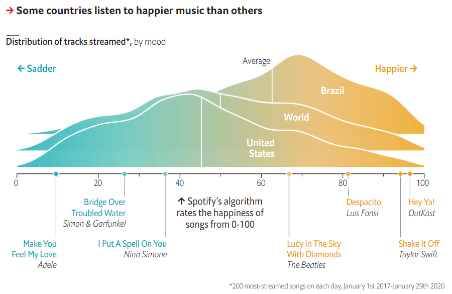
source: https://www.economist.com/graphic-detail/2020/02/08/data-from-spotify-suggest-that-listeners-are-gloomiest-in-february

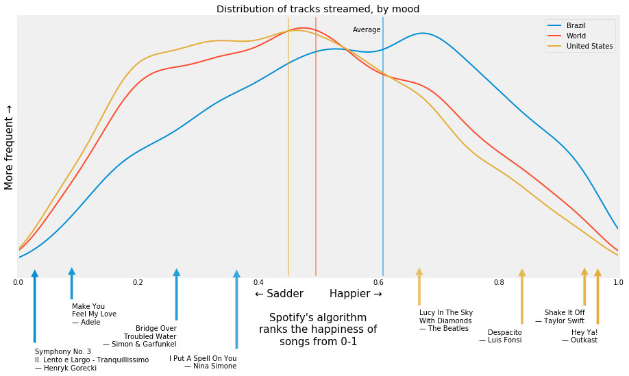

Despite the different appearances of our two charts, the shape of the two kernel density estimations is very similar (if you're not familiar, a kernel density estimation, or KDE, is pretty much just a smooth histogram with the area under the curve summing up to 1). The locations of those key songs along the valence axis also matches up. You can see that on average, Brazilians listen to "happier" music than the rest of the world, and in the United States listeners stream music which on average is less happy than the rest of the world. As we'll see, the music of Latin America typical scores very high in valence.

It's the second chart from The Economist where I see some key differences.

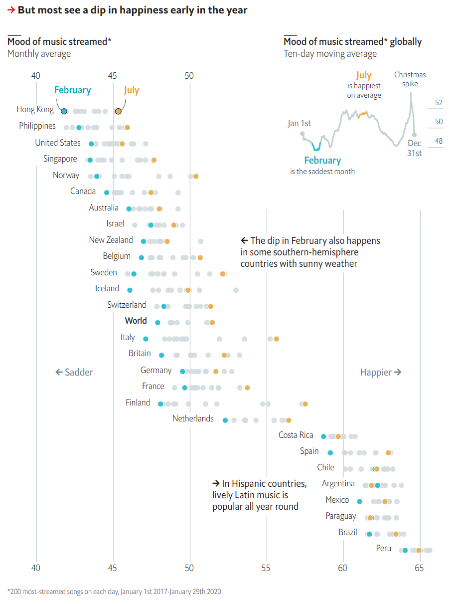
source: https://www.economist.com/graphic-detail/2020/02/08/data-from-spotify-suggest-that-listeners-are-gloomiest-in-february

First, let's look at that ten-day moving average chart in the upper right corner. It finds that February displays the lowest average valence and July the highest. Here is what I found:

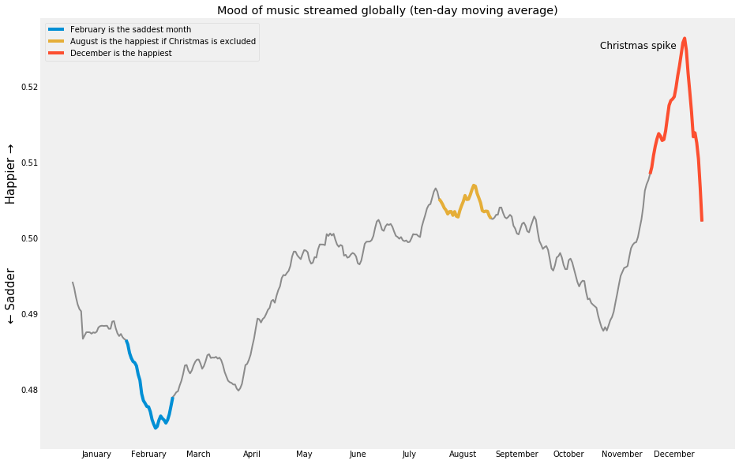

In my analysis, December has the highest average valence, followed by August, and then in third place is July. I initially found some very different average valence scores for February as well, and so investigated why our data sets could be different. The Economist used data from January 1st, 2017 (the earliest available on Spotify Charts) until January 29th, 2020 (presumably, when they performed their scraping). I had all of that data, plus almost all of February 2020 as well. Without aggregating by month, as the above plot does, and also not performing a moving average, I saw a much wider variance in the same month from year to year than I expected:

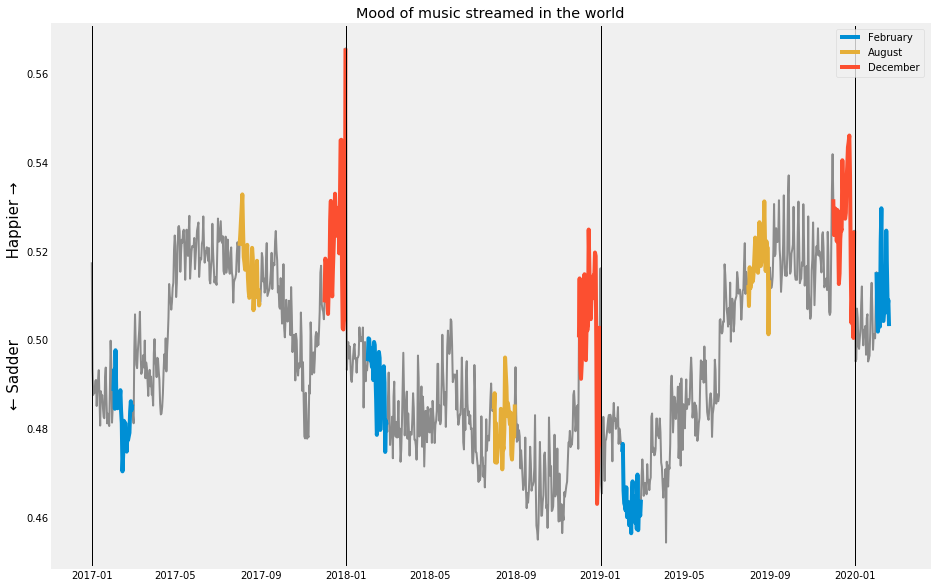

In any given year, I did see December as the highest. However, in 2018 (a particularly sad year?) the summer featured lower valence scores than February. Additionally, the inclusion of 2020 data, which is much higher than the previous years, acted to inflate February's average across time. Therefore, I chose to exclude 2020 data. Compare these two charts, one with 2020 included and the other without:

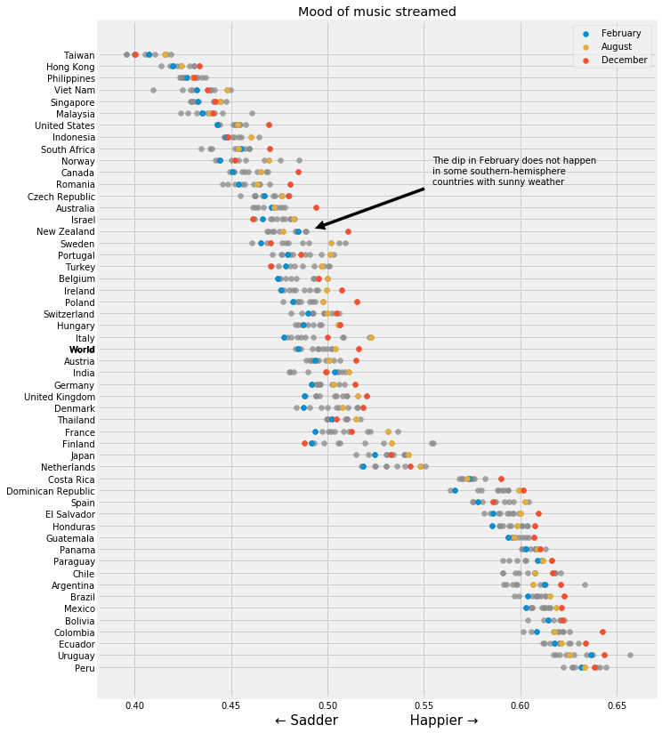

Above: including Jan/Feb 2020

Below: excluding Jan/Feb 2020

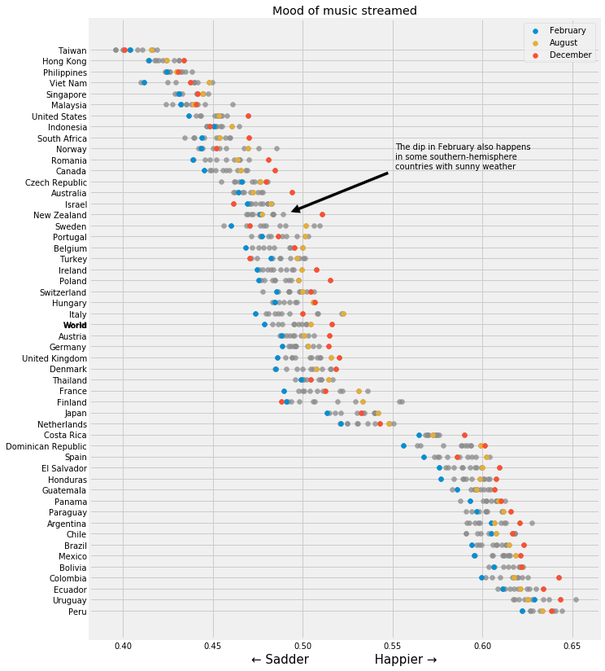

This doesn't change the charts a great deal, however one key point The Economist noted in their chart was that southern hemisphere New Zealand also experiences a dip in valence in February despite the reversal of their summers and winters compared to the northern hemisphere. When I include February 2020, I see the opposite effect as to what The Economist noticed, but when I exclude February 2020, then I do see the dip; however much less pronounced that what The Economist saw. Following The Economist's convention of including all available data though, I would include February and because 2020 was so much happier than previous years, this proves the opposite point to be true. Including this data does unfortunately seem somewhat arbitrary to me - what do we call an appropriate cutoff point? Including an equal number of months in each year seems reasonable to me though, so slightly less arbitrary to exclude the 2020 data. I'll be curious to rerun this analysis at the end of the year and see what it looks like then.

A key finding of mine though which is most certainly different than what The Economist found is that December is the happiest month, not July as they found.

I also sorted the countries into continents to look at wider trends. As The Economist found, Latin American countries do indeed stream *much* happier music than the rest of the world. Also to note is that in every continent except Europe, December is the happiest month; and February the saddest everywhere except Africa and Australia:

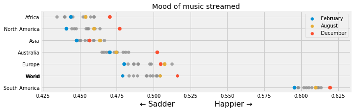

Additionally, I looked at mood by day. As I had expected, I found Saturday to be the happiest.

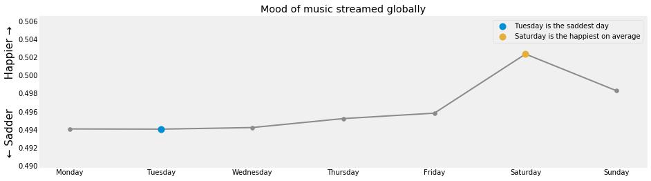

I also looked at this chart for just the US and New Zealand. I found Friday to be the saddest day in the United States and Sunday to be the happiest. Any theories why this may be? New Zealand exhibits the behavior I'd probably most expect, with Monday being the saddest and Saturday the happiest.

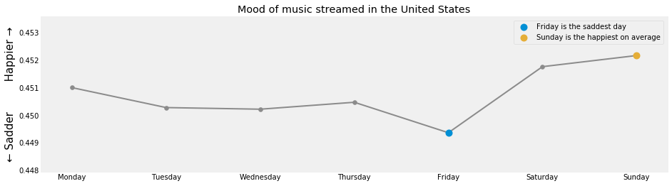
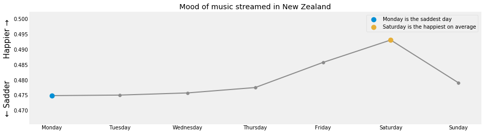

Finally, I did spend a bit of time looking into the other features available via the Spotify API and made one last chart, danceability for each country:

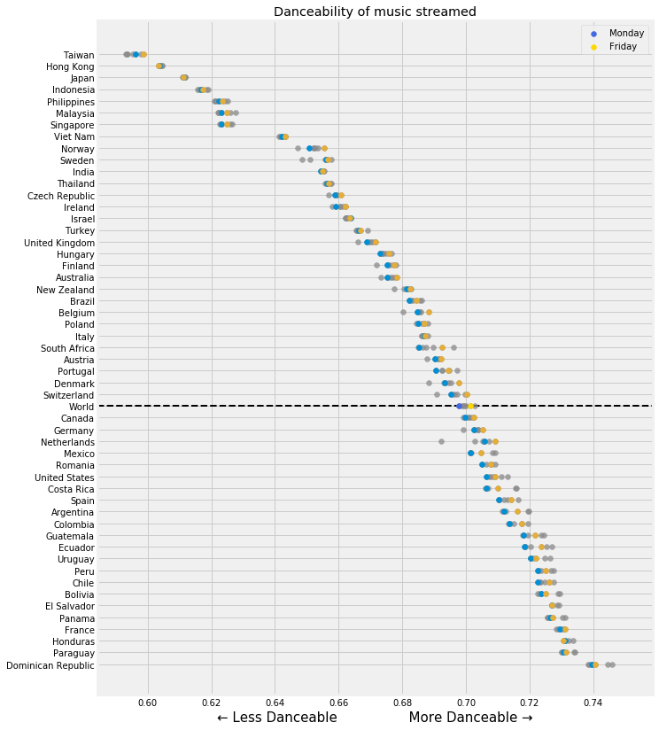

Here, I found Fridays to feature more danceable music than Mondays, as I was expecting. Furthermore, the ordering of the countries shifts around a lot from the valence chart. For instance, the United States is at the sadder end of the valence spectrum but at the more danceable end in this chart. I also noted that the lowest countries as ranked by danceability are all Asian countries with traditional music styles which do not fit the "standard" western 12-tone, 4-beats-to-a-bar system. I wonder if the algorithm has a tough time predicting danceability when the structure is so different than the majority of training samples.

I also noted that on Sundays in the Netherlands, their danceability score plummets! Norway and Sweden experience this phenomenon, although to a lesser extent. Religious Sundays may be one explanation for this result, although the Netherlands, Norway, and Sweden don't seem to me to be particularly more religious than many other countries which don't exhibit this behavior.

Just for fun, I looked up the saddest song I know (tragically missing from the Top 200 charts), the 3rd symphony by Henryk Górecki (titled, very appropriately, Symphony of Sorrowful Songs). The 2nd movement features a valence score of just 0.0280, well below Adele's *Make You Feel My Love* at 0.0896. This score would place it second-to-last on the valence chart for all 68,000+ songs in the Top 200, just slightly above Tool's *Legion Inoculant*, the saddest song in the charts with a valence of 0.0262 (although, in my opinion, this composition by Tool really stretches the definition of "song" beyond reasonableness).

I also looked up Pharrel Williams' *Happy*, expecting to find a peak score, and was disappointed to see that it's "only" 0.9620. Compare that to the almost comically happy *September* by Earth, Wind & Fire, with a valence score of 0.982 (the highest in the charts).

The top 10 happiest songs in the United States' top 200 rankings:

1. [Earth, Wind & Fire - September](https://open.spotify.com/track/1mqlc0vEP9mU1kZgTi6LIQ)
2. [Gene Autry - Here Comes Santa Claus (Right Down Santa Claus Lane)](https://medium.com/r/?url=https%3A%2F%2Fopen.spotify.com%2Ftrack%2F25leEEaz1gIpp7o21Fqyjo)
3. [The Beach Boys - Little Saint Nick - 1991 Remix](https://medium.com/r/?url=https%3A%2F%2Fopen.spotify.com%2Ftrack%2F5xlS0QkVrSH7ssEbBgBzbM)
4. [Logic - Indica Badu](https://medium.com/r/?url=https%3A%2F%2Fopen.spotify.com%2Ftrack%2F0jqBo5RYn008f4ZY8kPewW)
5. [Chuck Berry - Johnny B. Goode](https://medium.com/r/?url=https%3A%2F%2Fopen.spotify.com%2Ftrack%2F3BUQFs6aFWh7EFNmI8bfL7)
6. [Shawn Mendes - There's Nothing Holdin' Me Back](https://medium.com/r/?url=https%3A%2F%2Fopen.spotify.com%2Ftrack%2F79cuOz3SPQTuFrp8WgftAu)
7. [Foster The People - Pumped Up Kicks](https://medium.com/r/?url=https%3A%2F%2Fopen.spotify.com%2Ftrack%2F7w87IxuO7BDcJ3YUqCyMTT)
8. [Tom Petty - I Won't Back Down](https://medium.com/r/?url=https%3A%2F%2Fopen.spotify.com%2Ftrack%2F7gSQv1OHpkIoAdUiRLdmI6)
9. [OutKast - Hey Ya!](https://medium.com/r/?url=https%3A%2F%2Fopen.spotify.com%2Ftrack%2F2PpruBYCo4H7WOBJ7Q2EwM)
10. [Aretha Franklin - Respect](https://medium.com/r/?url=https%3A%2F%2Fopen.spotify.com%2Ftrack%2F7s25THrKz86DM225dOYwnr)

And the top 10 saddest songs:

1. [TOOL - Legion Inoculant](https://medium.com/r/?url=https%3A%2F%2Fopen.spotify.com%2Ftrack%2F48C0O5CXfQdfjUCUhOs1YP)
2. [Joji - I'LL SEE YOU IN 40](https://medium.com/r/?url=https%3A%2F%2Fopen.spotify.com%2Ftrack%2F606F3qdYCXtDVtKN53YsuW)
3. [Trippie Redd - RMP](https://medium.com/r/?url=https%3A%2F%2Fopen.spotify.com%2Ftrack%2F5e4oAwSsIzkNZxh4fLSKUH)
4. [Drake - Days in The East](https://medium.com/r/?url=https%3A%2F%2Fopen.spotify.com%2Ftrack%2F4czcw3NVLY0of5hTD7OufN)
5. [Drake - Jaded](https://medium.com/r/?url=https%3A%2F%2Fopen.spotify.com%2Ftrack%2F3jipFRgLyKK0oJoG1pKicx)
6. [Lil Uzi Vert - Two®](https://medium.com/r/?url=https%3A%2F%2Fopen.spotify.com%2Ftrack%2F65kp3OFn7JXbCvkm3m2Ui2)
7. [TOOL - Litanie contre la Peur](https://medium.com/r/?url=https%3A%2F%2Fopen.spotify.com%2Ftrack%2F4qE9yOgBNsARadpZTAb6RH)
8. [Russ - Cherry Hill](https://medium.com/r/?url=https%3A%2F%2Fopen.spotify.com%2Ftrack%2F7eZOvhHWlB3AcrOuZfTTOA)
9. [2 Chainz - Whip (feat. Travis Scott)](https://medium.com/r/?url=https%3A%2F%2Fopen.spotify.com%2Ftrack%2F6Z4rmc0uujCpl8yXe3yjgI)
10. [Rae Sremmurd - Bedtime Stories (feat. The Weeknd) - From SR3MM](https://medium.com/r/?url=https%3A%2F%2Fopen.spotify.com%2Ftrack%2F6nI74KsH94IN0J2vp5shdT)

So, it seems that Andy Williams is correct: December actually is [the Most Wonderful Time of the Year](https://www.youtube.com/watch?v=gFtb3EtjEic) (valence score: 0.7240).
