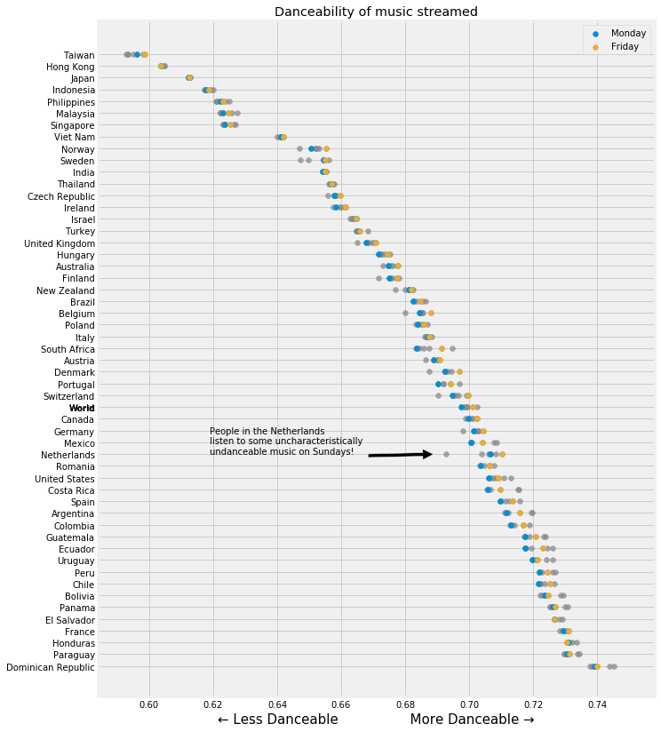

# Spotify Analysis

data from
- https://www.kaggle.com/tomigelo/spotify-audio-features
- https://www.tableau.com/about/blog/2019/7/how-visualize-spotify-music-trends-tableau

additional data
- https://www.kaggle.com/edumucelli/spotifys-worldwide-daily-song-ranking
- https://www.kaggle.com/zaheenhamidani/ultimate-spotify-tracks-db

## Some countries listen to happier music than others

## But most see a dip in happiness early in the year

In Hispanic countries, lively Latin music is popular all year round

